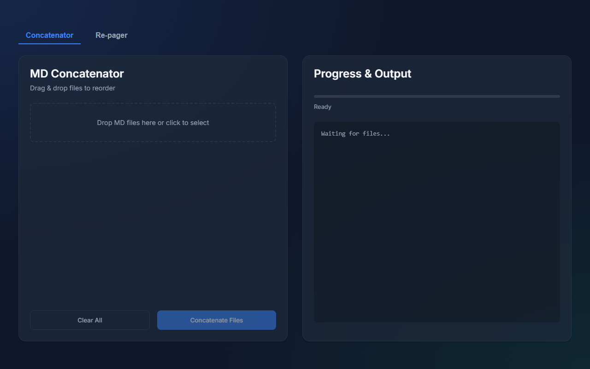

# MD File Concatenator and Repager

This tool helps manage large PDF to Markdown conversions where page numbering needs correction.

## Use Case

1.  **Large PDF Handling**: You have a single big PDF file (over 50 MB). You split it to severall files less then 50 MB
2.  **OCR Conversion**: You upload every single file to [https://docstrange.nanonets.com/](https://docstrange.nanonets.com/) to convert it to Markdown via OCR.
3.  **Page Numbering Issue**: Docstrange creates page numbers based on the actual page in the given PDF chunk, not the original document page number.
4.  **Fragmented Output**: After processing, you get several Markdown files with incorrect page numbers.
5.  **Solution**: Use `md_concat_js` to change page numbers and then concatenate them into a single Markdown file.

## Installation

1.  **Clone the repository**:
    ```bash
    git clone https://github.com/kzmx23/md-file-concatenator-and-repager.git
    cd md-file-concatenator-and-repager
    ```

2.  **Install dependencies**:
    ```bash
    npm install
    ```

## Usage

1.  **Start the application**:
    ```bash
    npm run dev
    ```

2.  **Open in Browser**:
    Open your browser and navigate to the URL shown in the terminal (usually `http://localhost:5173`).

3.  **Concatenate Files**:
    - Drag and drop your Markdown files into the left pane.
    - Reorder them as needed.
    - Click "Process" to re-page and concatenate them.
    - Download the result.

## Screenshot


